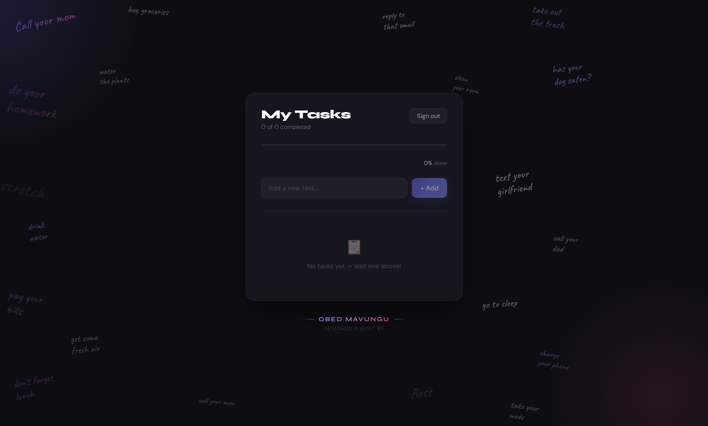

# Productivity SaaS

A full-stack task manager built with React, Node.js and PostgreSQL — with real-time updates, task sharing, and Firebase Authentication.

## Live Demo
https://productivity-saas-silk.vercel.app

## Features

- Firebase Authentication (email/password + Google)
- Create, complete, archive and delete tasks
- Share tasks with view/edit permissions
- Real-time updates via Socket.IO (rooms per task and per user)
- Activity log and productivity insights
- Progress tracking with priority and due dates

## Tech Stack

Frontend:
- React 19 + TypeScript + Vite
- Firebase Auth
- Socket.IO client
- React Router

Backend:
- Node.js + Express 5
- Socket.IO
- Firebase Admin SDK
- Resend (transactional email)

Database:
- PostgreSQL

## Continuous Integration

Every push and PR runs the [CI workflow](./.github/workflows/ci.yml):

- **Frontend** — ESLint, TypeScript type-check, Vite production build
- **Backend** — `node --check` syntax pass on every `.js` file under `src/` and `scripts/`

## Screenshot

